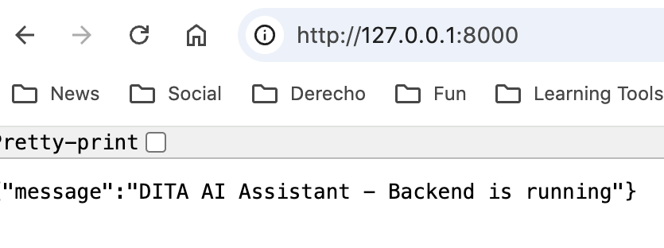
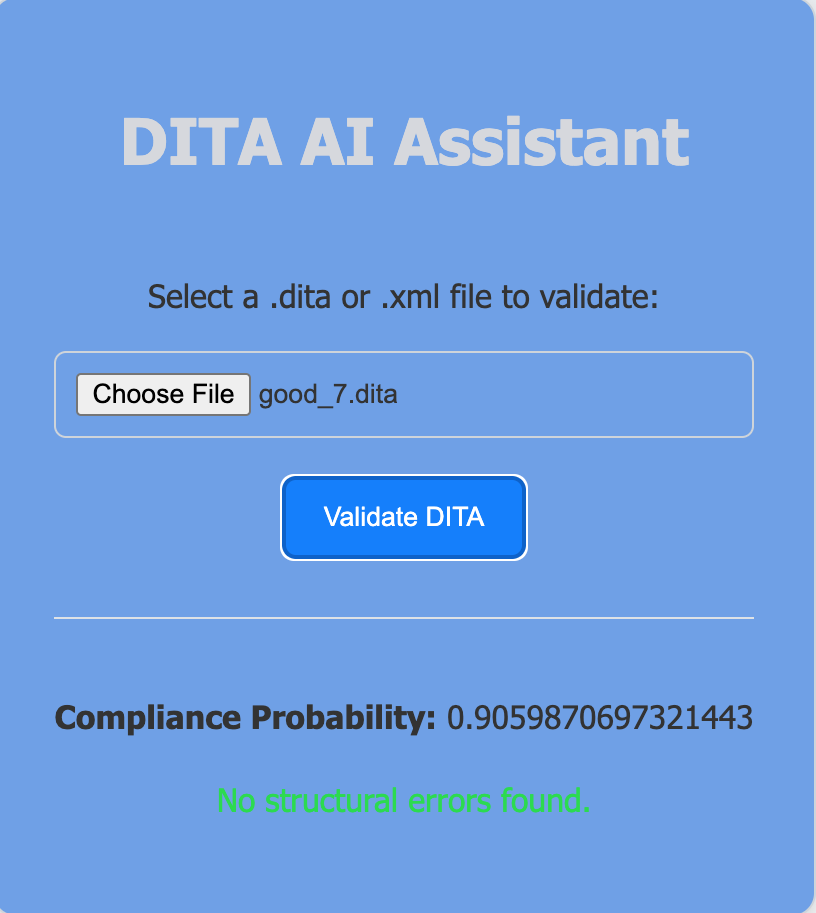
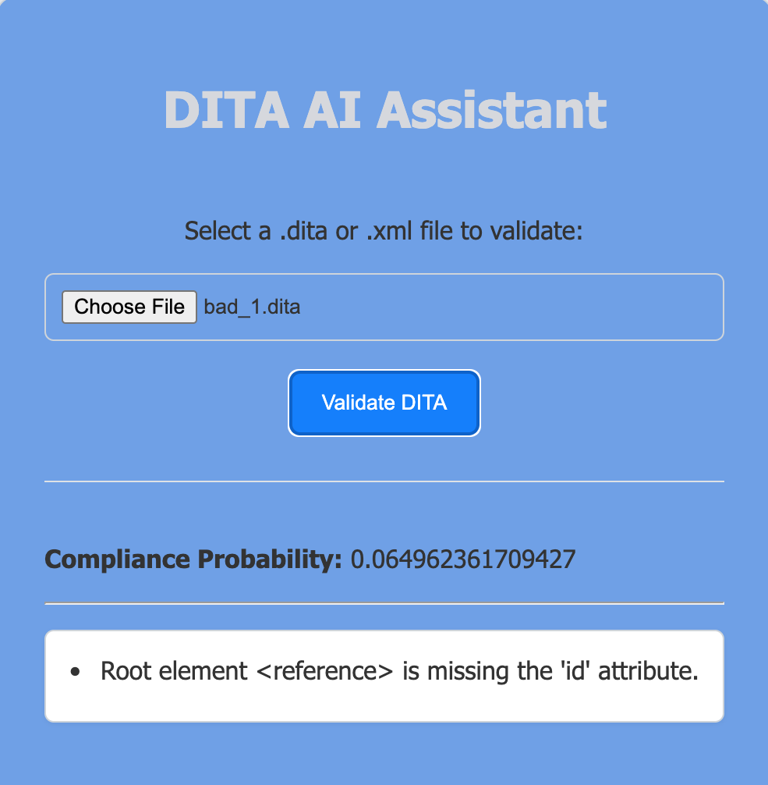

# AI-Assisted DITA

## Project Aim

This repository showcases a **proof-of-concept** AI-assisted and rule-based validation tool for DITA (Darwin Information Typing Architecture) files. The goal is to demonstrate how machine learning can **classify** `.dita` files as compliant or non-compliant, while **rule-based** checks catch structural and syntactic issues.

---

## Contents

1. [Overview](#overview)  
2. [Screenshots](#screenshots)  
3. [Project Structure](#project-structure)  
4. [Installation & Setup](#installation--setup)  
5. [Training the Model](#training-the-model)  
6. [Running the Backend](#running-the-backend)  
7. [Using the Minimal Frontend](#using-the-minimal-frontend)  
8. [Future Improvements](#future-improvements)

---

## Overview

1. **Machine Learning Compliance Score**  
   - We use a logistic regression model (or similarly trained classifier) to assign a **compliance probability** (between 0.0 and 1.0). Files with a higher score are more likely to be “compliant” according to the training data.

2. **Rule-Based Checks**  
   - The system checks whether the root element is `<concept>`, `<task>`, or `<reference>`.  
   - Ensures there is an `id` attribute on the root element.  
   - Looks for missing `<title>` within concept/task/reference topics.  
   - Flags XML well-formedness issues (like mismatched tags or malformed attributes).

3. **Minimal Frontend**  
   - A single HTML page (`index.html`) that lets you **upload** a `.dita` file to the backend.  
   - Displays compliance probability and any structural errors returned by the server.

---

## Screenshots

### 1. Backend Running
When the FastAPI server is running on `127.0.0.1:8000`, you should see something like this:



### 2. Compliant File
Uploading a **compliant** `.dita` file yields a higher compliance probability and **no structural errors**:



### 3. Non-Compliant File
A **non-compliant** `.dita` file (missing `id`, invalid root element, etc.) shows a lower compliance score and a list of errors:



---

## Project Structure

A typical structure for this repository might look like:

AI-Assisted-DITA/
├── .venv/                      # Python virtual environment
├── LICENSE                     # License file
├── README.md                   # This readme
├── backend/
│   ├── pycache/
│   ├── app.py                 # FastAPI routes, ML & rule-based checks
│   ├── model.py               # Model definitions
│   ├── models/                # Model directory
│   └── train_model.py         # Script to train ML model
├── data/
│   ├── compliant/             # Example good DITA files
│   └── non_compliant/         # Example bad DITA files
├── images/
│   ├── backend_running.png    # Backend server screenshot
│   ├── compliant_file.png     # Compliant validation screenshot
│   └── non_compliant_file.png # Non-compliant validation screenshot
├── index.html                 # HTML/CSS frontend
├── models/
│   ├── model.pkl             # Trained classifier
│   └── vectorizer.pkl        # Text vectorizer
├── requirements.txt          # Python dependencies
├── populate_data.py         # Script to create DITA files
└── test_script.py          # Test script

## Installation & Setup

1. **Clone** this repo:

git clone https://github.com/carlosrod723/AI-Assisted-DITA.git

2. **Create** and **activate** a Python virtual environment (recommended):
```
python -m venv .venv source .venv/bin/activate
```

*(On Windows: `.venv\Scripts\activate`)*

3. **Install** dependencies:
```bash
pip install -r requirements.txt
```

4. (Optional) Populate your DITA dataset if you want to see various examples

```
python populate_data.py
```

This script creates .dita files under data/compliant/ and data/non_compliant/.

## Training the Model

If you need to retrain or update the logistic regression model:

Ensure .dita files exist in data/compliant/ and data/non_compliant/.
Run:
```
bash
Copy code
cd backend
python train_model.py
```

This creates model.pkl and vectorizer.pkl in the models/ folder.

## Running the Backend

From the project root (or wherever app.py is accessible):

Start the FastAPI server:
bash
```
uvicorn backend.app:app --reload
```

Check the console output. You should see something like:
```
INFO:     Uvicorn running on http://127.0.0.1:8000
```

Open a browser at http://127.0.0.1:8000. You should see:
```
{"message":"DITA AI Assistant - Backend is running"}
```

That means the backend is ready for file uploads at /validate.

## Using the Frontend
1. Locate index.html in the project.
2. Open it in your browser (double-click or drag-drop).
3. If you see a CORS error, you may need to serve index.html via a local server or allow null origin in your CORS config.
4, Choose a .dita file.
5. Click "Validate DITA."
6. A compliance probability and any structural errors appear on screen.

Ensure your FastAPI server runs at 127.0.0.1:8000 to receive the file.

